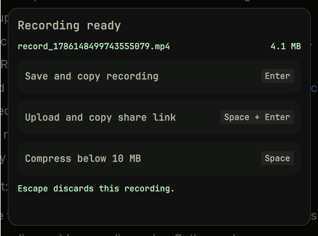

# ClipShare

ClipShare is a Dank Material Shell plugin for recording a screen region and deciding what happens to the finished video without leaving the keyboard.



## Features

- GPU-accelerated region recording through GPU Screen Recorder.
- Shows the recording filename and size before acting.
- Copies the original file immediately with Enter.
- Copies recordings already below 10 MB immediately with Space.
- Compresses larger recordings below 10 MB with selectable Balanced, Best quality, or Fast GPU AV1 modes.
- Uploads to Catbox and copies either the direct URL or an Autocompressor short embed link.
- Extracts the first video frame for Autocompressor thumbnails.
- Moves long-running work into a configurable, non-blocking corner HUD.
- Lets you configure the recording and completion-panel shortcuts.
- Lets you choose the recording folder, defaulting to `~/Videos/ClipShare`.
- Deletes local recordings only after successful compression or upload. Failed operations keep the original for retry.

## Requirements

- Dank Material Shell 1.5.2 or newer
- Niri or Hyprland
- `gpu-screen-recorder`
- `ffmpeg` and `ffprobe`
- `slurp`
- `pactl`
- `curl`
- `jq`

On Arch Linux:

```bash
sudo pacman -S gpu-screen-recorder ffmpeg slurp libpulse curl jq
```

Fast GPU compression requires an AV1-capable VAAPI encoder. Balanced and Best quality use software SVT-AV1 and work without hardware AV1 encoding.

## Installation

Clone the repository into the DMS plugin directory:

```bash
git clone https://github.com/agneswd/dms-clipshare ~/.config/DankMaterialShell/plugins/clipShare
dms restart
```

Enable ClipShare in DMS Settings, then set the system-wide recording shortcut from the plugin settings. The default is `Shift+Print`.

Niri is live-tested. Hyprland uses the same DMS-managed keybind flow and is covered by provider-level tests, but has not been live-tested by the author.

## Usage

Press the recording shortcut once, select a region, and press it again to finish.

| Default shortcut | Action |
| --- | --- |
| `Enter` | Keep and copy the original recording. |
| `Space` | Copy immediately below 10 MB, otherwise compress below 10 MB and copy. |
| `Space+Enter` | Upload using the selected upload mode and copy the resulting URL. |
| `Escape` | Discard the recording. |

All shortcuts are configurable. For panel shortcuts, use one named key or letter. The share shortcut uses two keys joined by `+`.

## Upload modes

- **Catbox only** uploads the video and copies its direct public Catbox URL.
- **Catbox + Autocompressor** uploads the video and first-frame thumbnail to Catbox, creates an Autocompressor short embed link, and copies that link.

Uploads are public to anyone with the URL. Anonymous Catbox uploads cannot be deleted through ClipShare. A successful upload removes the local recording; an upload failure keeps it.

## Compression modes

- **Balanced** is the default. It uses two-pass SVT-AV1 preset 6.
- **Best quality** uses two-pass SVT-AV1 preset 4 and takes longer.
- **Fast GPU** uses a detected VAAPI AV1 encoder. It is much faster but gives lower quality at the same size.

## Testing

```bash
bash tests/clipshare-record.test.sh
bash tests/clipshare-process.test.sh
bash tests/clipshare-keybind.test.sh
qmllint ClipShareDaemon.qml ClipShareModal.qml ClipShareProgress.qml ClipShareSettings.qml
```

## License

MIT
